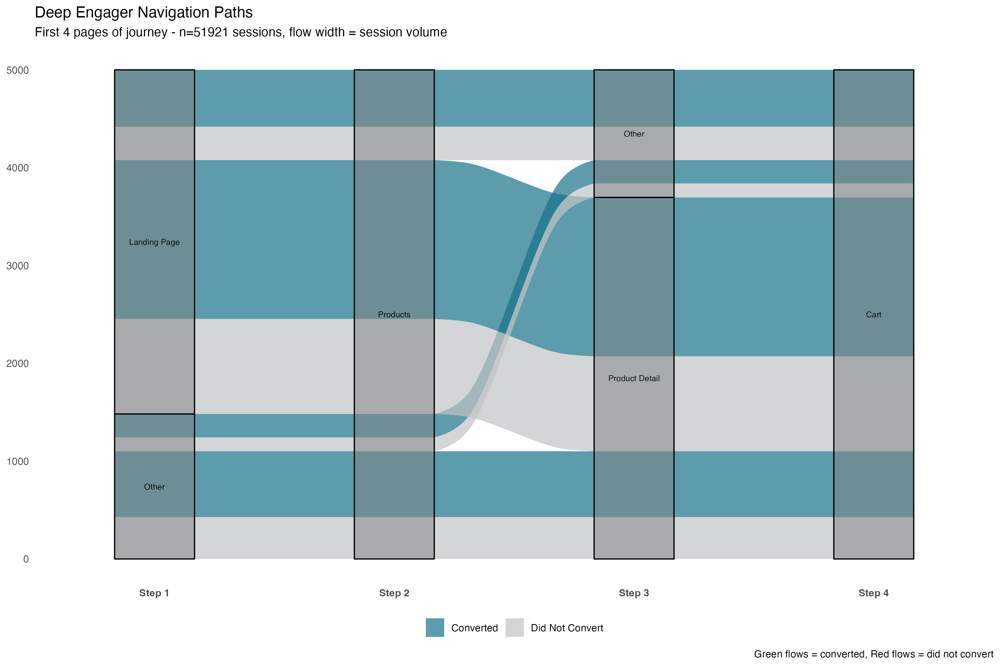

Every e-commerce analysis I've seen reports the same metric: **overall conversion rate**. For this dataset—473,000 sessions from an online toy retailer—it's 6.83%.

That number tells you almost nothing. (Sorry.)

## What I Found

- **There are different kinds of sessions.** The aggregate 6.83% conversion rate masks two completely different populations: a small group converting at 62% (I call them Deep Engagers), and everyone else at... basically zero. It's like averaging the heights of kindergarteners and NBA players and concluding everyone is 4'8".

- **Engagement isn't loyalty.** Deep Engagers (the 62% converters) are 81% first-time visitors. They rarely repeat that behavior on return visits—only 12% stay Deep Engagers. Turns out "ready to buy" is a mood, not a personality.

- **Bouncing isn't fatal.** Among users who bounce on their first visit then return, 12% become Deep Engagers on visit 2. First-session bouncing may be research behavior, not rejection. Sometimes "I'll think about it" actually means "I'll think about it."

- **The question changes.** Instead of "how do we improve 6.83%?" it's "how do we turn Window Shoppers (35% of traffic, 0% conversion) into Deep Engagers?"

## The Standard Analysis

Here's what every portfolio project shows: 6.83% conversion rate. Desktop converts better than mobile. Traffic drops off at the cart stage. The standard funnel looks like this:

These are aggregate metrics. They assume all users are interchangeable units flowing through the same linear path at different completion rates.

Spoiler: they're not.

## A Different Question

Instead of asking "What's our conversion rate?", I asked: **"What types of journeys do users actually take?"**

I clustered 473,000 sessions by behavioral features: pages viewed, products viewed, time spent, funnel progression—excluding conversion itself to avoid circular logic. (Nothing ruins an analysis faster than accidentally proving that buyers... buy things.) Five distinct archetypes emerged (92% variance explained, silhouette = 0.79). Then I examined conversion outcomes post-hoc.

## The Five Journey Archetypes

The clustering revealed five distinct behavioral signatures. Here they are as radar charts—think of each one as a "fingerprint" showing how that group behaves across six dimensions:

*Each spoke = behavioral metric (page depth, products viewed, session duration, % who reach cart/billing). Farther from center = higher value.*

**Bouncers (45%):** One page, instant exit. 0% conversion. The "nope" crowd.

**Window Shoppers (35%):** Browse 2-3 pages, view products, spend 107 sec/page. Never reach cart. 0% conversion. They're looking, not buying.

**Cart Abandoners (9%):** Reach cart, some reach billing. 0% conversion. The "wait, how much for shipping??" population.

**Deep Engagers (11%):** Navigate 6-7 pages, spend 124 sec/page (most deliberate), reach cart/shipping/billing. **62% conversion.** These are your people.

The 38% of Deep Engagers who don't convert reach billing (99.5% complete) but stop—likely price shock, payment friction, or that moment of "do I really need this?" we've all experienced at 2am.

## The Reveal

**Deep Engagers are 11% of sessions. They generate 100% of revenue.**

The other 89% of users—Bouncers, Window Shoppers, and Cart Abandoners—convert at approximately 0%.

The aggregate 6.83% conversion rate is basically a statistical illusion. It's averaging two completely different populations: a small group that converts at 62%, and a large group that converts at 0%.

## What Actually Differentiates Them?

Since I clustered on navigation (not conversion), what *else* differs?

**Time per page:** Deep Engagers spend 124 seconds—they're reading, comparing, deliberating. Bouncers: 0 seconds. They came, they saw, they bounced.

**Device (χ² p < 0.001):** Desktop users are 2.3x more likely to become Deep Engagers. (Hard to buy toys while standing in line at Starbucks, apparently.)

**What doesn't differ:** Time of day, day of week, holiday season. Temporal patterns don't predict journey type—user intent does.

## The Navigation Paths

Deep Engagers follow a clear pattern: Landing → Products → Product Detail → Cart → Shipping → Billing → Thank You. **38% follow this exact "golden path."** The rest show minor variations but converge on the same checkout funnel.

Cart Abandoners show high diversity, suggesting many different abandonment triggers (a mystery for another day).

## The Temporal Dimension: What Happens on Return Visits?

These archetypes aren't permanent user traits—they're **situational behaviors** that change across sessions.

Among users who return after bouncing on visit 1:
- **40% become Window Shoppers** (they start browsing)
- **37% bounce again** (old habits)
- **12% become Deep Engagers** (ready to buy)

**Deep Engagement is fleeting:** Only 12% of Deep Engagers repeat that behavior on their next visit. The rest become Bouncers (38%) or Window Shoppers (39%). This suggests Deep Engagement reflects **purchase** readiness in that moment, not some inherent user personality type.

Translation: you're not converting "Deep Engager people." You're catching people in a Deep Engager *moment*.

Conversion improves slightly with session number (6.7% → 7.8% → 8.0%), but the gains are modest. The bigger opportunity: understanding which first-session behaviors predict eventual conversion.

## Why This Matters

The standard question—*"How do we improve 6.83%?"*—assumes incremental gains across all users. But 89% of users convert at 0%. You can't incrementally improve zero. (Math is unforgiving that way.)

Better questions:
- **How do we turn Window Shoppers into Deep Engagers?** (35% of traffic, 0% conversion, clear intent)
- **What triggers the transition from Bouncer → Deep Engager?** (12% make this leap on visit 2)
- **Why do Deep Engagers abandon at billing?** (99.5% complete, then stop)

Window Shoppers already demonstrate intent—they browse products, spend 107 sec/page. What's missing? Product information? Social proof? Cart clarity? Cart Abandoners reach billing (99.5% complete) and stop. Price shock? Shipping costs? Payment friction? These are specific, testable hypotheses.

## The Methodological Point

Most analyses report aggregate metrics and optimize for averages. But this dataset doesn't have one conversion rate: it has five, ranging from 0% to 62%. The variance is the signal, not the noise.

I avoided circular logic by clustering on behavior (navigation patterns, not outcomes), validating clusters (92% variance explained), then examining conversion post-hoc. The result: distinct archetypes with actionable intervention points.

## What I'd Do Next

1. **Real-time classification:** Identify archetypes early in session based on behavioral signals
2. **Personalized interventions:** Strong value props for Bouncers, social proof for Window Shoppers, reduced friction for Cart Abandoners
3. **Archetype-specific A/B tests:** Test interventions within segments, not across all users
4. **Track distribution shifts:** Are we moving users from low-value to high-value archetypes?

## Technical Details

**Data:** 473K sessions, 1.2M pageviews, 32K conversions (Maven Fuzzy Factory dataset)
**Methods:** K-means clustering, silhouette analysis, chi-square tests, entropy measures
**Tools:** R (tidyverse, ggplot2, ggalluvial, cluster)
**Code:** [GitHub repository](https://github.com/sjweston/journey-topology-analysis) *(full scripts and visualizations)*

---

The 6.83% conversion rate isn't wrong. It's just **incomplete**. Behind that single number are five distinct user populations with fundamentally different behaviors and needs.

Aggregate metrics are convenient. But they hide everything interesting.

---

*This analysis demonstrates skills in user journey mapping, behavioral segmentation, statistical clustering, and translating technical findings into business insights—exactly what I bring to data science and UX research roles.*