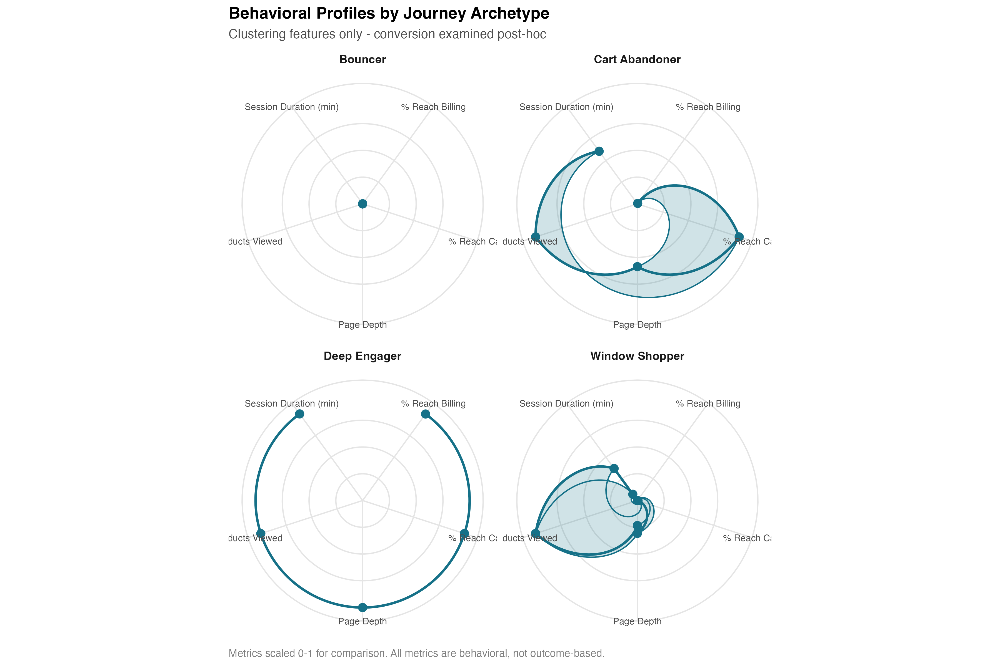
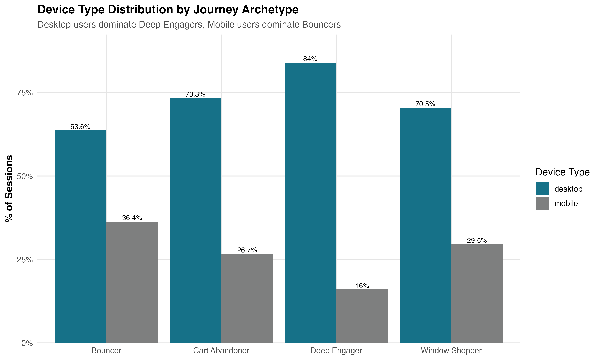
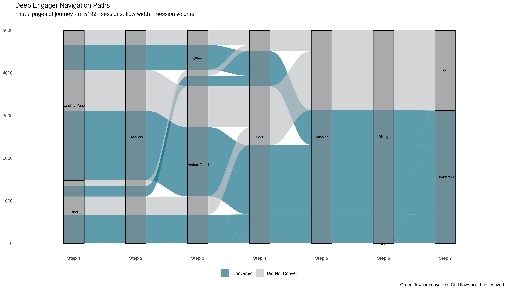

Every e-commerce analysis I've seen reports the same metric: **overall conversion rate**. For this dataset—473,000 sessions from an online toy retailer—it's 6.83%.

That number tells you almost nothing.

## The Standard Analysis

Here's what every portfolio project shows: 6.83% conversion rate. Desktop converts better than mobile. Traffic drops off at the cart stage. The standard funnel looks like this:

These are aggregate metrics. They assume all users are interchangeable units flowing through the same linear path at different completion rates. But what if that's wrong?

## A Different Question

Instead of asking *"What's our conversion rate?"*, I asked: **"What types of journeys do users actually take?"**

I analyzed 473,000 sessions and 1.2 million pageviews. For each session, I captured behavioral features:
- **Pages viewed** (depth and breadth of exploration)
- **Time spent** (total session duration and per-page deliberation)
- **Funnel progression** (did they reach cart? shipping? billing?)
- **Navigation sequence** (the actual path taken)

Then I ran k-means clustering using **only these behavioral features**—critically, I excluded conversion itself. This avoids circular logic: I wanted to see if natural behavioral groups exist first, *then* examine whether they differ in conversion.

Five distinct clusters emerged with 92.4% of variance explained and a silhouette score of 0.79 (indicating strong, well-separated groups). These weren't statistical artifacts—they were real behavioral archetypes.

## The Five Journey Archetypes

The clustering revealed five distinct behavioral signatures. Here they are visualized as radar charts—think of each one as a "fingerprint" showing how that group behaves across six dimensions:

*How to read these: Each spoke represents a different metric (page depth, products viewed, % who reach cart, % who reach billing, conversion rate, revenue per session). The farther from center, the higher the value. Metrics are scaled 0-1 for comparison.*

Here's what they look like:

### 1. Bouncers (45% of sessions)
One page. Zero seconds. Instant exit.

They land on a page—73% on designed landing pages—and immediately leave. Their radar chart is nearly flat: minimal engagement across all dimensions. **0% conversion**.

### 2. Window Shoppers (35% of sessions)
They browse 2-3 pages and view products. They spend 107 seconds per page—they're not rushing. They're genuinely looking.

Their radar shows moderate page depth and product views, but drops to zero at cart. **0% conversion**.

### 3. Cart Abandoners (9% of sessions)
They make it to the cart. Some even reach shipping (65%) or billing (45%). They're *so close*.

Their radar stretches far on page depth and cart reach, but collapses at conversion. **0% conversion**.

### 4. Deep Engagers (11% of sessions)
Here's where it gets interesting.

They navigate through 6-7 pages. They spend **124 seconds per page**—the most deliberate of any group. They reach cart, shipping, and billing.

Their radar is nearly maxed out across all dimensions. And they convert at **62.2%**.

## The Reveal

**Deep Engagers are 11% of sessions. They generate 100% of revenue.**

The other 89% of users—Bouncers, Window Shoppers, and Cart Abandoners—convert at approximately 0%.

The aggregate 6.83% conversion rate is meaningless. It's an average of two completely different populations: a small group that converts at 62%, and a large group that converts at 0%.

## What Actually Differentiates Them?

Remember, I didn't cluster on conversion. I clustered on navigation behavior. So what *else* differs between Deep Engagers and everyone else?

I ran post-hoc analyses on non-tautological factors:

**Time per page:**
- Deep Engagers: 124 seconds
- Bouncers: 0 seconds

This isn't about conversion—it's about **deliberation**. Deep Engagers are considering their purchase. They're reading product details, comparing options, thinking it through.

**Device type (χ² p < 0.001):**

- Deep Engagers: 84% desktop
- Bouncers: 64% desktop, 36% mobile

Desktop users are 2.3x more likely to become Deep Engagers. The mobile experience is driving bounces.

**What *doesn't* differ:**
- Time of day (all ~57% business hours)
- Day of week (all ~15% weekend)
- Holiday season (all ~23% Nov/Dec)

Temporal patterns don't predict journey type. User intent does.

## The Navigation Paths

To understand *how* these journeys differ, I mapped the actual navigation sequences. Here's what Deep Engagers do:

Deep Engagers follow remarkably similar paths: Landing → Products → Product Detail → Cart → Shipping → Billing → Thank You. This is the "golden path."

Bouncers, in contrast, have almost zero path diversity (entropy = 0.58). They land and exit. That's it.

Cart Abandoners, interestingly, show the *highest* path diversity (entropy = 1.83), other than Deep Engagers. There are many different ways to abandon a cart, suggesting many different reasons for abandonment.

## Why This Matters

The standard question is: *"How do we improve our 6.83% conversion rate?"*

That question assumes incremental improvement across all users. But 89% of users convert at 0%. You can't incrementally improve zero.

The better question is: **"How do we turn Window Shoppers into Deep Engagers?"**

Window Shoppers (35% of sessions) already demonstrate intent—they browse products, they spend 107 seconds per page. They're engaged but not converting.

What's stopping them?
- Are they missing key product information?
- Do they lack social proof or urgency signals?
- Is the path to cart unclear?
- Are they comparison shopping elsewhere?

Similarly for Cart Abandoners (9% of sessions): They made it to the cart. Some reached *billing*—99.5% of the way there—and still didn't convert. Why?
- Price shock at checkout?
- Unexpected shipping costs?
- Payment friction?
- Technical issues?

These are specific, answerable questions with specific interventions.

## The Methodological Point

Most analyses of this dataset (and I've reviewed dozens on GitHub) report aggregate metrics. They assume a single homogeneous population. They optimize for averages.

But averages hide the underlying structure. This dataset doesn't have one conversion rate—it has five, ranging from 0% to 62%. The variance is the signal, not the noise.

I demonstrated this with a non-tautological approach:
1. Cluster users by **navigation behavior** (pages, time, depth)
2. Validate cluster quality (92% variance explained, silhouette = 0.79)
3. Examine conversion **post-hoc** (avoid circular logic)
4. Test what else differs (device, time-per-page, visitor type)
5. Map actual navigation paths (Sankey diagrams)

The result: behavioral archetypes with distinct conversion profiles, engagement patterns, and intervention opportunities.

## What I'd Do Next

If this were my company, I'd:

1. **Instrument behavioral signals in real-time** to classify users into archetypes early in their session
2. **Personalize the experience** based on archetype:
   - Show Bouncers strong value props immediately
   - Give Window Shoppers social proof and urgency
   - Reduce friction for Cart Abandoners (free shipping threshold? Payment options?)
3. **A/B test interventions** within each archetype separately (not across all users)
4. **Track archetype distribution over time**—are we shifting users from low-value to high-value archetypes?

## Technical Details

**Data:** 473K sessions, 1.2M pageviews, 32K conversions (Maven Fuzzy Factory dataset)
**Methods:** K-means clustering, silhouette analysis, chi-square tests, entropy measures
**Tools:** R (tidyverse, ggplot2, ggalluvial, cluster)
**Code:** [GitHub repository](https://github.com/yourusername/journey-topology-analysis) *(full scripts and visualizations)*

---

The 6.83% conversion rate isn't wrong. It's just **incomplete**. Behind that single number are five distinct user populations with fundamentally different behaviors and needs.

Aggregate metrics are convenient. But they hide everything interesting.

---

*This analysis demonstrates skills in user journey mapping, behavioral segmentation, statistical clustering, and translating technical findings into business insights—exactly what I bring to data science and UX research roles.*
