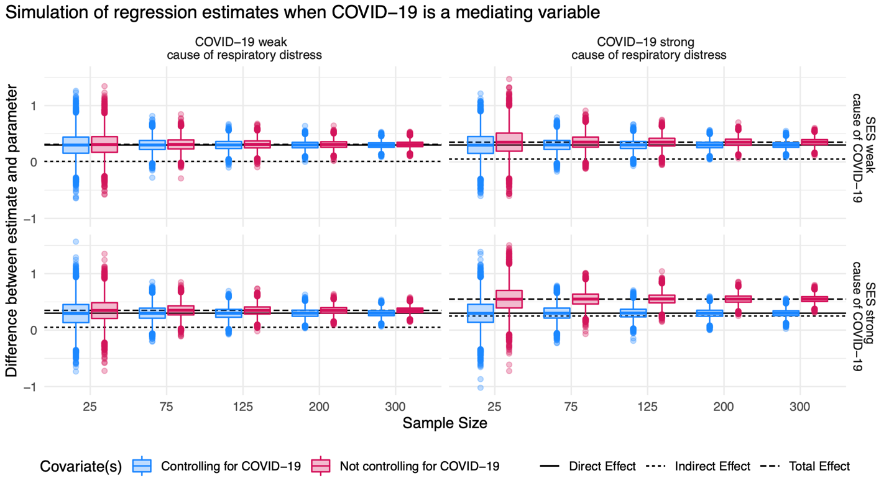

## Why we asked

In spring 2020, researchers studying stress, inflammation, and mental health had a new problem. Many of their participants might have been infected, or might be infected soon, and testing was too limited to know who. Whatever the virus does to the body could distort a study about something else. We wanted to point out that the fix is not automatic. Whether to control for COVID-19 depends on where it sits in the causal model.

## What we did

This was a short commentary, and we used simulations to make the point. We simulated data with the lavaan package in R, varied the sample size and the strength of the effects, and ran each combination 10,000 times. We compared two regression models: one with COVID-19 as a covariate and one without. We looked at three scenarios.

## What we found

In the first scenario, COVID-19 causes both inflammation and mortality, so it is a confounder. Models that left it out overestimated the effect of inflammation on mortality, and a bigger sample did not fix that. The bias was largest when the virus was a strong cause of both.

In the second scenario, low socioeconomic status raises the chance of COVID-19, which in turn causes respiratory distress, so COVID-19 is a mediator. Here the model that left the virus out came closest to the total effect of socioeconomic status. Controlling for the virus removed part of that effect. In other words, adjusting for a variable on the pathway hides some of the very effect you are trying to measure.

The third scenario is the hard one. Low immune functioning may make people more susceptible to the virus, and the virus also lowers immune functioning during recovery, so it could be a confounder or a mediator. We suggest that researchers use temporal order where they can, and otherwise report both the unadjusted and the adjusted relationship.

## What it means

Simulated results only show what follows from the causal model we assume, and the real model is rarely known. Researchers should state where they think COVID-19 sits before deciding whether to adjust for it.
