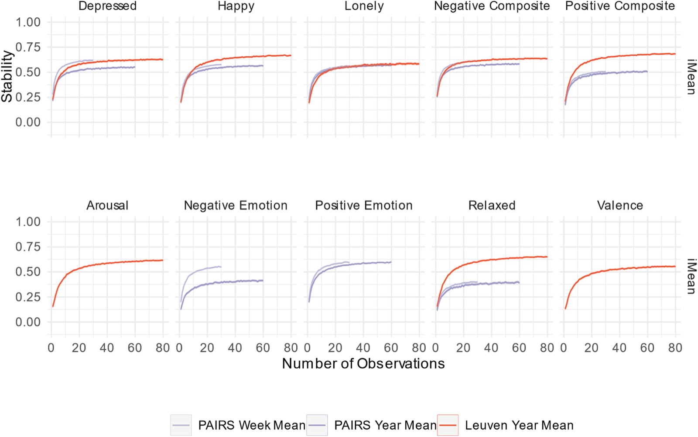

## Why we asked

Experience sampling studies ask people how they feel several times a day for days or weeks. Researchers then boil those reports down to two numbers per person: the intraindividual mean (iM), or how happy or lonely someone typically is, and the intraindividual standard deviation (iSD), or how much their feelings swing. Both are often treated as traits, meaning stable features of a person. We wanted to know whether that holds up, and how many surveys per person a study needs before it does. These studies are costly for participants and for scientists, so the answer matters for planning.

## What we did

We used two existing experience sampling datasets that each ran in two bursts about a year apart. The PAIRS study (N = 416) surveyed people four times a day for two weeks, and the Leuven study (N = 191) surveyed them ten times a day for one week. Participants were mostly college-age. For each person we computed iMs and iSDs from different numbers of each person's reports, and asked how well scores at the first burst predicted scores at the second. We treated a retest correlation of .50 as a benchmark for a modest level of stability.

## What we found

Means were reasonably stable. A one-year correlation of .50 took an average of 14 observations per person, and one-year stabilities were in line with what other work reports for daily emotion and neuroticism. Standard deviations were less stable. They needed an average of 42 observations to reach .50, and many items never reached it. In the Leuven data, one-year stability of iSDs reached about .52 with 80 observations, while in the PAIRS data it was about .20 with 60. The two studies differed in several ways, including how often people were sampled and how many dropped out, so we can only speculate about why.

## What it means

In other words, an average from a typical experience sampling study says something about the person, while a standard deviation from the same study may say more about that person during that stretch of time. If variability measured this way fails to predict a later outcome, we cannot tell whether variability does not matter or whether it was measured too noisily. We did not test how sampling frequency, apart from the total number of observations, affects these results.

We recommend that researchers not assume iSDs are traits without evidence.
